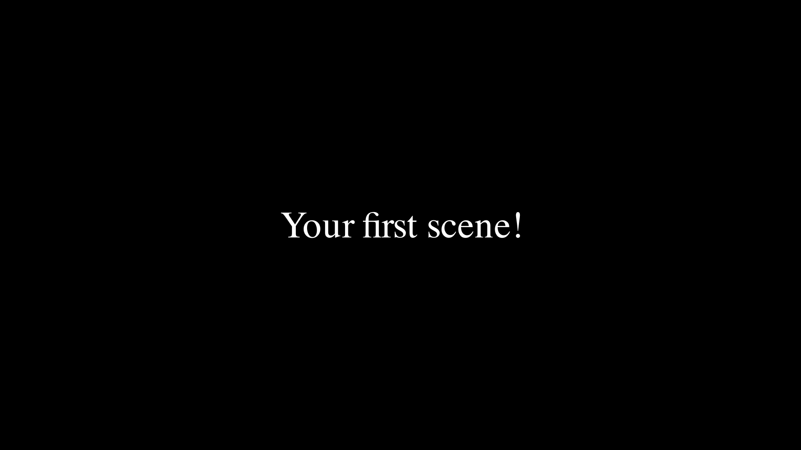
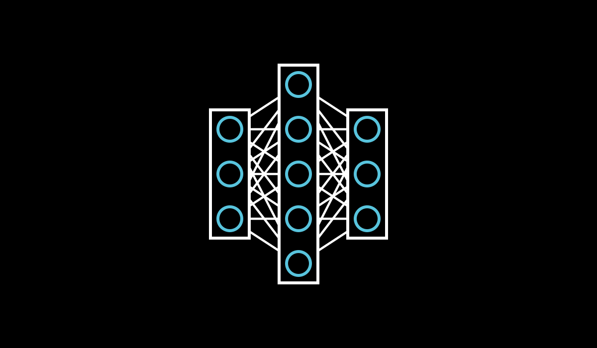
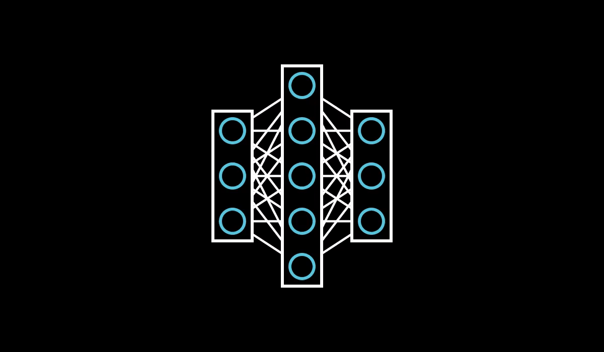

# ManimML
<a href="https://github.com/helblazer811/ManimMachineLearning">
    
</a>

[](https://github.com/helblazer811/ManimMachineLearning/blob/main/LICENSE.md)
[](https://img.shields.io/github/v/release/helblazer811/ManimMachineLearning)
[](https://pepy.tech/project/manim-ml)

ManimML is a project focused on providing animations and visualizations of common machine learning concepts with the [Manim Community Library](https://www.manim.community/). Please check out [our paper](https://arxiv.org/abs/2306.17108). We want this project to be a compilation of primitive visualizations that can be easily combined to create videos about complex machine learning concepts. Additionally, we want to provide a set of abstractions which allow users to focus on explanations instead of software engineering.

*A sneak peak ...*


## Table of Contents

- [ManimML](#manimml)
  - [Table of Contents](#table-of-contents)
  - [Getting Started](#getting-started)
    - [Installation](#installation)
    - [First Neural Network](#first-neural-network)
  - [Guide](#guide)
    - [Setting Up a Scene](#setting-up-a-scene)
    - [A Simple Feed Forward Network](#a-simple-feed-forward-network)
    - [Animating the Forward Pass](#animating-the-forward-pass)
    - [Convolutional Neural Networks](#convolutional-neural-networks)
    - [Convolutional Neural Network with an Image](#convolutional-neural-network-with-an-image)
    - [Max Pooling](#max-pooling)
    - [Activation Functions](#activation-functions)
    - [More Complex Animations: Neural Network Dropout](#more-complex-animations-neural-network-dropout)
  - [Citation](#citation)

## Getting Started 

### Installation

First you will want to [install manim](https://docs.manim.community/en/stable/installation.html). Make sure it is the Manim Community edition, and not the original 3Blue1Brown Manim version. 

Then install the package form source or
`pip install manim_ml`. Note: some recent features may only available if you install from source. 

### First Neural Network

This is a visualization of a Convolutional Neural Network. The code needed to generate this visualization is shown below. 

```python
from manim import *

from manim_ml.neural_network import Convolutional2DLayer, FeedForwardLayer, NeuralNetwork

# This changes the resolution of our rendered videos
config.pixel_height = 700
config.pixel_width = 1900
config.frame_height = 7.0
config.frame_width = 7.0

# Here we define our basic scene
class BasicScene(ThreeDScene):

    # The code for generating our scene goes here
    def construct(self):
        # Make the neural network
        nn = NeuralNetwork([
                Convolutional2DLayer(1, 7, 3, filter_spacing=0.32),
                Convolutional2DLayer(3, 5, 3, filter_spacing=0.32),
                Convolutional2DLayer(5, 3, 3, filter_spacing=0.18),
                FeedForwardLayer(3),
                FeedForwardLayer(3),
            ],
            layer_spacing=0.25,
        )
        # Center the neural network
        nn.move_to(ORIGIN)
        self.add(nn)
        # Make a forward pass animation
        forward_pass = nn.make_forward_pass_animation()
        # Play animation
        self.play(forward_pass)
```

You can generate the above video by copying the above code into a file called `example.py` and running the following in your command line (assuming everything is installed properly):

```bash
$ manim -pql example.py
```
The above generates a low resolution rendering, you can improve the resolution (at the cost of slowing down rendering speed) by running: 

```bash
$ manim -pqh example.py
```


## Guide

This is a more in depth guide showing how to use various features of ManimML (Note: ManimML is still under development so some features may change, and documentation is lacking). 

### Setting Up a Scene

In Manim all of your visualizations and animations belong inside of a `Scene`. You can make a scene by extending the `Scene` class or the `ThreeDScene` class if your animation has 3D content (as does our example). Add the following code to a python module called `example.py`.

```python
from manim import *
# Import modules here

class BasicScene(ThreeDScene):

    def construct(self):
        # Your code goes here
        text = Text("Your first scene!")
        self.add(text)
```

In order to render the scene we will run the following in the command line:

```bash
$ manim -pq -l example.py
```



This will generate an image file in low quality (use `-h` for high quality).

For the rest of the tutorial the code snippets will need to be copied into the body of the `construct` function.

### A Simple Feed Forward Network

With ManimML we can easily visualize a simple feed forward neural network.

```python
from manim_ml.neural_network import NeuralNetwork, FeedForwardLayer

nn = NeuralNetwork([
    FeedForwardLayer(num_nodes=3),
    FeedForwardLayer(num_nodes=5),
    FeedForwardLayer(num_nodes=3)
])
self.add(nn)
```

In the above code we create a `NeuralNetwork` object and pass a list of layers to it. For each feed forward layer we specify the number of nodes. ManimML will automatically piece together the individual layers into a single neural network. We call `self.add(nn)` in the body of the scene's `construct` method in order to add the neural network to the scene. 

The majority of ManimML neural network objects and functions can be imported directly from `manim_ml.neural_network`. 

We can now render a still frame image of the scene by running:

```bash
$ manim -pql example.py
```



### Animating the Forward Pass

We can automatically render the forward pass of a neural network by creating the animation with the `neural_network.make_forward_pass_animation` method and play the animation in our scene with `self.play(animation)`. 

```python
from manim_ml.neural_network import NeuralNetwork, FeedForwardLayer
# Make the neural network
nn = NeuralNetwork([
    FeedForwardLayer(num_nodes=3),
    FeedForwardLayer(num_nodes=5),
    FeedForwardLayer(num_nodes=3)
])
self.add(nn)
# Make the animation
forward_pass_animation = nn.make_forward_pass_animation()
# Play the animation
self.play(forward_pass_animation)
```

We can now render with:

```bash
$ manim -pql example.py
```



### Convolutional Neural Networks

ManimML supports visualizations of Convolutional Neural Networks. You can specify the number of feature maps, feature map size, and filter size as follows `Convolutional2DLayer(num_feature_maps, feature_map_size, filter_size)`. There are a number of other style parameters that we can change as well(documentation coming soon).

Here is a multi-layer convolutional neural network. If you are unfamiliar with convolutional networks [this overview](https://cs231n.github.io/convolutional-networks/) is a great resource. Additionally, [CNN Explainer](https://poloclub.github.io/cnn-explainer/) is a great interactive tool for understanding CNNs, all in the browser. 

When specifying CNNs it is important for the feature map sizes and filter dimensions of adjacent layers match up. 

```python
from manim_ml.neural_network import NeuralNetwork, FeedForwardLayer, Convolutional2DLayer

nn = NeuralNetwork([
        Convolutional2DLayer(1, 7, 3, filter_spacing=0.32), # Note the default stride is 1. 
        Convolutional2DLayer(3, 5, 3, filter_spacing=0.32),
        Convolutional2DLayer(5, 3, 3, filter_spacing=0.18),
        FeedForwardLayer(3),
        FeedForwardLayer(3),
    ],
    layer_spacing=0.25,
)
# Center the neural network
nn.move_to(ORIGIN)
self.add(nn)
# Make a forward pass animation
forward_pass = nn.make_forward_pass_animation()
```

We can now render with:

```bash
$ manim -pql example.py
```


And there we have it, a convolutional neural network. 

### Convolutional Neural Network with an Image

We can also animate an image being fed into a convolutional neural network by specifiying an `ImageLayer` before the first convolutional layer. 

```python
import numpy as np
from PIL import Image
from manim_ml.neural_network import NeuralNetwork, FeedForwardLayer, Convolutional2DLayer, ImageLayer

image = Image.open("digit.jpeg") # You will need to download an image of a digit. 
numpy_image = np.asarray(image)

nn = NeuralNetwork([
        ImageLayer(numpy_image, height=1.5),
        Convolutional2DLayer(1, 7, 3, filter_spacing=0.32), # Note the default stride is 1. 
        Convolutional2DLayer(3, 5, 3, filter_spacing=0.32),
        Convolutional2DLayer(5, 3, 3, filter_spacing=0.18),
        FeedForwardLayer(3),
        FeedForwardLayer(3),
    ],
    layer_spacing=0.25,
)
# Center the neural network
nn.move_to(ORIGIN)
self.add(nn)
# Make a forward pass animation
forward_pass = nn.make_forward_pass_animation()
```

We can now render with:

```bash
$ manim -pql example.py
```


### Max Pooling

A common operation in deep learning is the 2D Max Pooling operation, which reduces the size of convolutional feature maps. We can visualize max pooling with the `MaxPooling2DLayer`. 

```python
from manim_ml.neural_network import NeuralNetwork, Convolutional2DLayer, MaxPooling2DLayer
# Make neural network
nn = NeuralNetwork([
        Convolutional2DLayer(1, 8),
        Convolutional2DLayer(3, 6, 3),
        MaxPooling2DLayer(kernel_size=2),
        Convolutional2DLayer(5, 2, 2),
    ],
    layer_spacing=0.25,
)
# Center the nn
nn.move_to(ORIGIN)
self.add(nn)
# Play animation
forward_pass = nn.make_forward_pass_animation()
self.wait(1)
self.play(forward_pass)
```

We can now render with:

```bash
$ manim -pql example.py
```


### Activation Functions

Activation functions apply non-linarities to the outputs of neural networks. They have different shapes, and it is useful to be able to visualize the functions. I added the ability to visualize activation functions over `FeedForwardLayer` and `Convolutional2DLayer` by passing an argument as follows:
```python
layer = FeedForwardLayer(num_nodes=3, activation_function="ReLU")
```

We can add these to larger neural network as follows:

```python
from manim_ml.neural_network import NeuralNetwork, Convolutional2DLayer, FeedForwardLayer
# Make nn
nn = NeuralNetwork([
        Convolutional2DLayer(1, 7, filter_spacing=0.32),
        Convolutional2DLayer(3, 5, 3, filter_spacing=0.32, activation_function="ReLU"),
        FeedForwardLayer(3, activation_function="Sigmoid"),
    ],
    layer_spacing=0.25,
)
self.add(nn)
# Play animation
forward_pass = nn.make_forward_pass_animation()
self.play(forward_pass)
```

We can now render with:

```bash
$ manim -pql example.py
```


### More Complex Animations: Neural Network Dropout

```python
from manim_ml.neural_network import NeuralNetwork, FeedForwardLayer
from manim_ml.neural_network.animations.dropout import make_neural_network_dropout_animation
# Make nn
nn = NeuralNetwork([
        FeedForwardLayer(3),
        FeedForwardLayer(5),
        FeedForwardLayer(3),
        FeedForwardLayer(5),
        FeedForwardLayer(4),
    ],
    layer_spacing=0.4,
)
# Center the nn
nn.move_to(ORIGIN)
self.add(nn)
# Play animation
self.play(
    make_neural_network_dropout_animation(
        nn, dropout_rate=0.25, do_forward_pass=True
    )
)
self.wait(1)
```

We can now render with:

```bash
$ manim -pql example.py
```


## Citation

If you found ManimML useful please cite it below!

```
@misc{helbling2023manimml,
      title={ManimML: Communicating Machine Learning Architectures with Animation}, 
      author={Alec Helbling and Duen Horng and Chau},
      year={2023},
      eprint={2306.17108},
      archivePrefix={arXiv},
      primaryClass={cs.LG}
}
```
