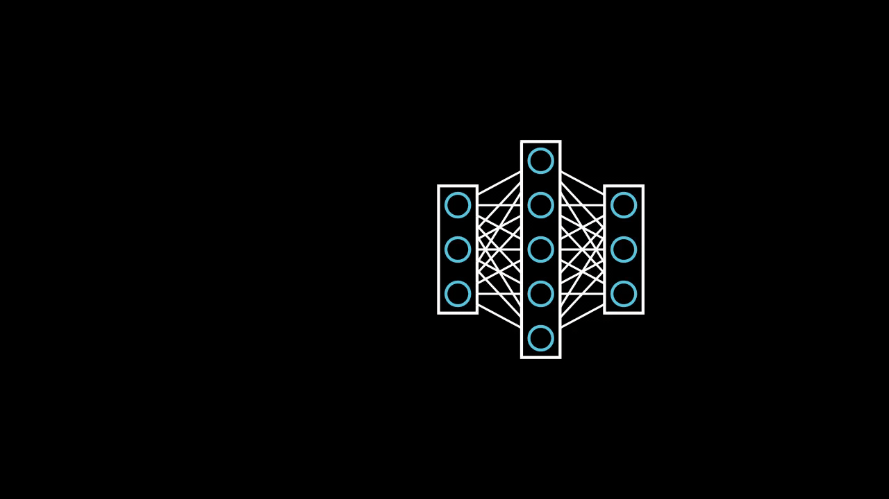

# ManimML
<a href="https://github.com/helblazer811/ManimMachineLearning">
    
</a>

[](https://github.com/helblazer811/ManimMachineLearning/blob/main/LICENSE.md)
[](https://img.shields.io/github/v/release/helblazer811/ManimMachineLearning)

[](https://twitter.com/alec_helbling)

ManimML is a project focused on providing animations and visualizations of common machine learning concepts with the [Manim Community Library](https://www.manim.community/). We want this project to be a compilation of primitive visualizations that can be easily combined to create videos about complex machine learning concepts. Additionally, we want to provide a set of abstractions which allow users to focus on explanations instead of software engineering.

## Table of Contents

1. [Getting Started](#getting-started)
2. [Examples](#examples)

## Getting Started 
First you will want to [install manim](https://docs.manim.community/en/stable/installation.html). 

Then install the package form source or
`pip install manim_ml`

Then you can run the following to generate the example videos from python scripts. 

`manim -pqh src/vae.py VAEScene`

## Examples

Checkout the ```examples``` directory for some example videos with source code. 

### Neural Networks

This is a visualization of a Neural Network made using ManimML. It has a Pytorch style list of layers that can be composed in arbitrary order. The following video is made with the code from below.  



```python
from manim import *
from manim_ml.neural_network.layers import FeedForwardLayer, ImageLayer
from manim_ml.neural_network.neural_network import NeuralNetwork
from PIL import Image
import numpy as np

class ImageNeuralNetworkScene(Scene):

    def construct(self):
        image = Image.open('images/image.jpeg')
        numpy_image = np.asarray(image)
        # Make nn
        layers = [
            ImageLayer(numpy_image, height=1.0),
            FeedForwardLayer(3), 
            FeedForwardLayer(5),
            FeedForwardLayer(3)
        ]
        nn = NeuralNetwork(layers)
        # Center the nn
        nn.move_to(ORIGIN)
        self.add(nn)
        # Play animation
        self.play(nn.make_forward_pass_animation())
```


### Variational Autoencoders

This is a visualization of a Variational Autoencoder. 


### VAE Disentanglement 

This is a visualization of disentanglement with a Variational Autoencoder


