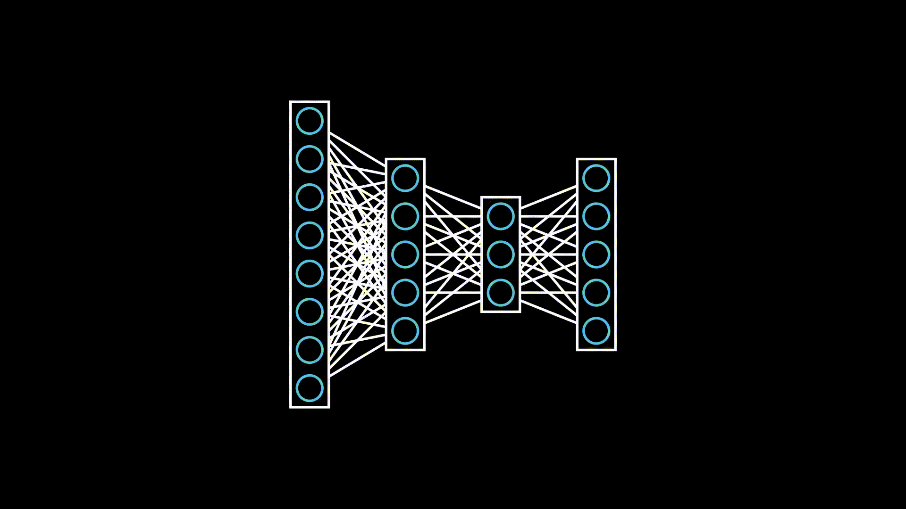

# Manim Machine Learning
<a href="https://github.com/helblazer811/ManimMachineLearning">
    
</a>

[](https://github.com/helblazer811/ManimMachineLearning/blob/main/LICENSE.md)
[](https://img.shields.io/github/v/release/helblazer811/ManimMachineLearning)
[](https://GitHub.com/helblazer811/ManimMachineLearning/releases/)
[](https://twitter.com/alec_helbling)

Manim Machine Learning is a project focused on providing animations and visualizations of common machine learning concepts with the [Manim Community Library](https://www.manim.community/). We want this project to be a compilation of primitive visualizations that can be easily combined to create videos about complex machine learning concepts. Additionally, we want to provide a set of abstractions which allow users to focus on explanations instead of software engineering.

## Table of Contents

1. [Getting Started](#getting-started)
2. [Examples](#examples)

## Getting Started 
First you will want to [install manim](https://docs.manim.community/en/stable/installation.html). Then you can run the following to generate the example videos. 

`manim -pqh src/vae.py VAEScene`

## Examples

Checkout the ```examples``` directory for some example videos with source code. 

### Variational Autoencoders

This is a visualization of a Variational Autoencoder. 


### VAE Disentanglement 

This is a visualization of disentanglement with a Variational Autoencoder


### Neural Networks

This is a visualization of a Neural Network. 


