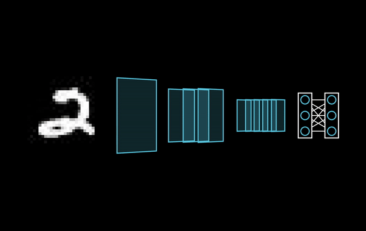

# ManimML
<a href="https://github.com/helblazer811/ManimMachineLearning">
    
</a>

[](https://github.com/helblazer811/ManimMachineLearning/blob/main/LICENSE.md)
[](https://img.shields.io/github/v/release/helblazer811/ManimMachineLearning)


ManimML is a project focused on providing animations and visualizations of common machine learning concepts with the [Manim Community Library](https://www.manim.community/). We want this project to be a compilation of primitive visualizations that can be easily combined to create videos about complex machine learning concepts. Additionally, we want to provide a set of abstractions which allow users to focus on explanations instead of software engineering.

## Table of Contents

1. [Getting Started](#getting-started)
2. [Examples](#examples)

## Getting Started 
First you will want to [install manim](https://docs.manim.community/en/stable/installation.html). 

Then install the package form source or
`pip install manim_ml`

Then you can run the following to generate the example videos from python scripts. 

`manim -pqh examples/cnn/cnn.py`

## Examples

Checkout the ```examples``` directory for some example videos with source code. 

### Convolutional Neural Network

This is a visualization of a Convolutional Neural Network.



```python
from manim import * 
from PIL import Image

from manim_ml.neural_network.layers.convolutional_2d import Convolutional2DLayer
from manim_ml.neural_network.layers.feed_forward import FeedForwardLayer
from manim_ml.neural_network.layers.image import ImageLayer
from manim_ml.neural_network.neural_network import NeuralNetwork

class ConvolutinoalNetworkScene(Scene):

    def construct(self):
        image = Image.open(ROOT_DIR / "assets/mnist/digit.jpeg")
        numpy_image = np.asarray(image)
        # Make nn
        nn = NeuralNetwork([
                ImageLayer(numpy_image, height=1.5),
                Convolutional2DLayer(1, 7, 3, filter_spacing=0.32),
                Convolutional2DLayer(3, 5, 3, filter_spacing=0.32),
                Convolutional2DLayer(5, 3, 3, filter_spacing=0.18),
                FeedForwardLayer(3),
                FeedForwardLayer(3),
            ],
            layer_spacing=0.25,
        )
        # Center the nn
        nn.move_to(ORIGIN)
        self.add(nn)
        self.play(neural_network.make_forward_pass_animation())
```

